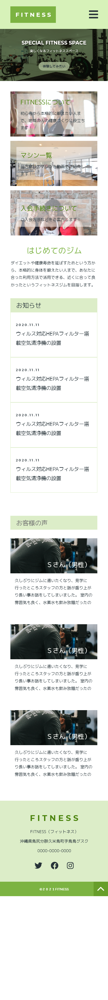
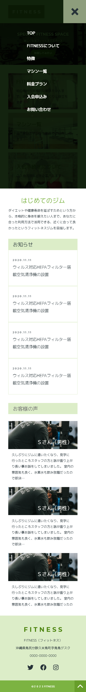

<!-- AUTO-GENERATED-CONTENT:START (STARTER) -->
<h1 align="center">
   Fictitious site
</h1>

This site is designed to look like a fictional site This site is designed to look like.
## Image Gallery

1.  **Top Page**

     
     

2.  **Nav Page**

    

## Description

This is a fictional site for a fitness gym, created in Gatsby.

## What's inside?

A quick look at the top-level files and directories you'll see in a Gatsby project.

    .
    ├── node_modules
    ├── src
    ├── .gitignore
    ├── .prettierrc
    ├── gatsby-browser.js
    ├── gatsby-config.js
    ├── gatsby-node.js
    ├── gatsby-ssr.js
    ├── LICENSE
    ├── package-lock.json
    ├── package.json
    └── README.md

<!-- AUTO-GENERATED-CONTENT:END -->
